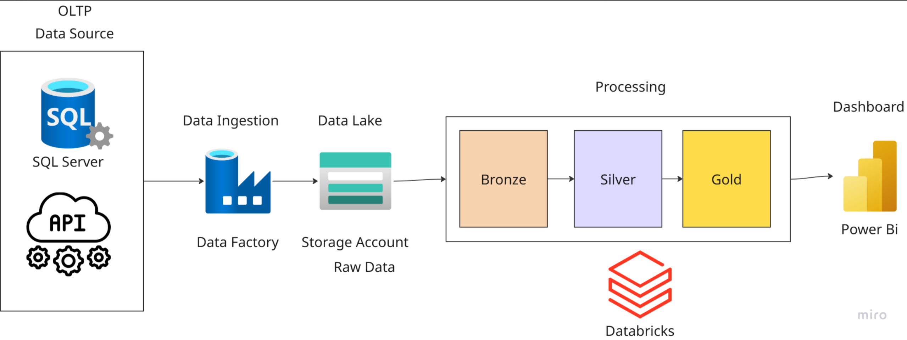
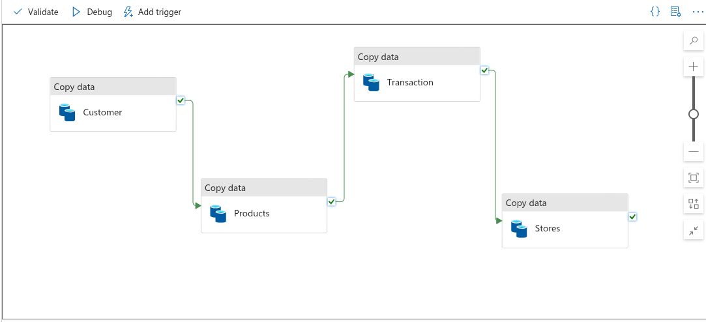
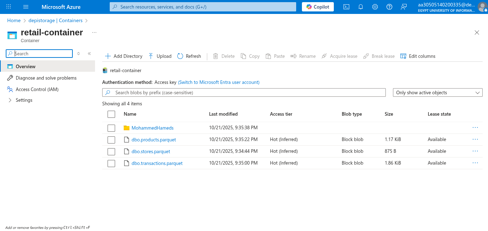
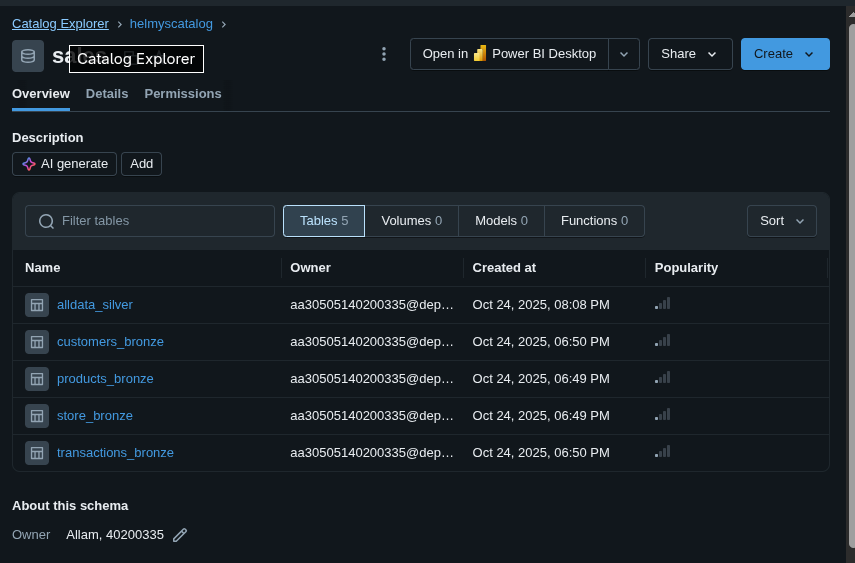
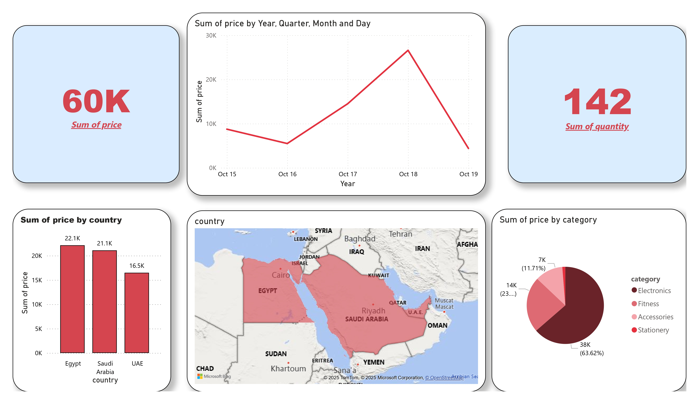

# End-to-End Retail Data ETL Pipeline with Azure and Power BI

This repository showcases a complete, end-to-end data engineering project. It details the process of building an ETL (Extract, Transform, Load) pipeline using Microsoft Azure services to ingest, process, and analyze retail data, ultimately visualizing key business insights in a Power BI dashboard.

## 🏛️ Project Architecture

The pipeline follows a modern data stack architecture, ingesting data from OLTP sources and processing it through a multi-layered (Medallion) architecture before serving it to an analytics tool.

## 🛠️ Technology Stack

* **Data Ingestion:** Azure Data Factory
* **Data Lake:** Azure Blob Storage (Data Lake Storage Gen2)
* **Data Transformation:** Azure Databricks (using PySpark)
* **Data Cataloging:** Databricks Unity Catalog
* **Data Visualization:** Power BI

---

## 🚀 Project Workflow

The data pipeline is broken down into three main stages: Ingestion, Transformation, and Visualization.

### 1. Data Ingestion (Extract & Load)

An **Azure Data Factory (ADF)** pipeline is used to extract data from various source systems (like a SQL database and APIs). The 'Copy data' activities in ADF transfer this raw data into a `retail-container` in **Azure Blob Storage**. The data is stored in the efficient `.parquet` format.

The raw parquet files for `products`, `stores`, and `transactions` are landed in the storage container, ready for processing.

### 2. Data Transformation (ETL with Databricks)

Once the raw data is in the data lake, an **Azure Databricks** notebook (`notebook_retail.ipynb`) performs the transformation using a **Medallion Architecture**:

* **Bronze Layer:** The raw parquet files are read into PySpark DataFrames and saved as tables in the **Databricks Catalog** (e.g., `customers_bronze`, `products_bronze`). This layer serves as the initial, raw, and immutable copy of the data.

* **Silver Layer:** The notebook performs cleaning operations (e.g., casting data types to the correct format) and then enriches the data by joining the various bronze tables (Customers, Products, Stores, Transactions) into a single, denormalized fact table named `alldata_silver`. This table becomes the "single source of truth" for all analytics.

### 3. Data Visualization (Power BI)

Finally, **Power BI** connects directly to the Databricks SQL Warehouse to query the `alldata_silver` table. This enables the creation of an interactive dashboard that provides key insights into the retail business without needing to move the data again.

---

## 📊 Final Dashboard

The Power BI dashboard provides a high-level overview of sales performance, including:
* **Key KPIs:** Total Price (38K) and Total Quantity (52).
* **Sales Trends:** A line chart showing the sum of price by date (Oct 15 - Oct 19).
* **Geographical Analysis:** A bar chart and a map showing the sum of price by country (Egypt, Saudi Arabia, UAE).
* **Category Breakdown:** A donut chart showing the sales distribution by product category (Electronics, Fitness, Accessories, Stationery).

